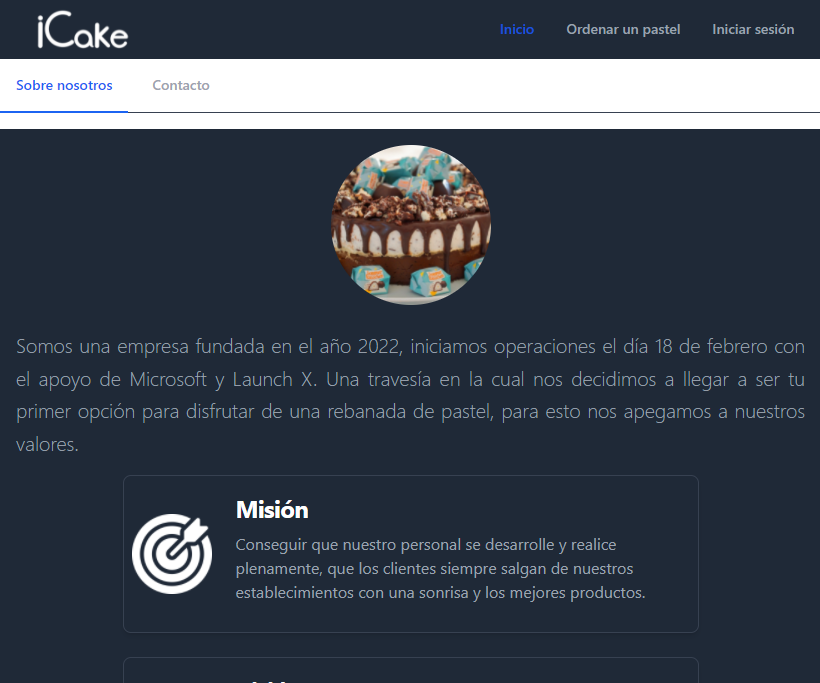
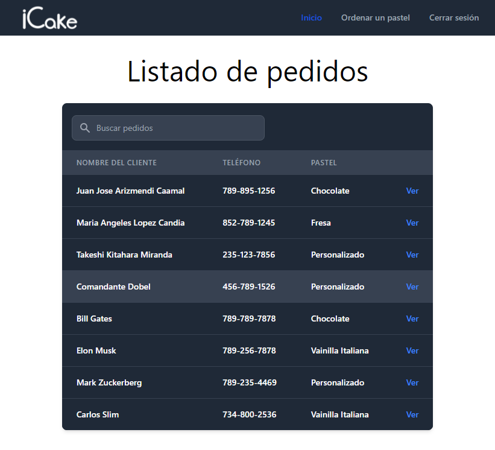

## iCake-HTML
Segunda práctica para el curso Full Stack JS con Launch X. 
Maquetado de un sitio web para una pastelería, implementando Tailwind CSS
<!-- LOGO -->
 

  <a href="https://github.com/Josue9405/iCake-HTML">
    
     
    
  </a>

  <h3 align="center">iCake</h3>

  

    Sitio para una pastelería
     
    <a href="https://josue9405.github.io/iCake-HTML/">Visitar sitio</a>
  

<!-- TABLA DE CONTENIDOS -->

  
Contenido

  <ol>
    <li>
      <a href="#acerca-del-proyecto">Acerca del proyecto</a>
      <ul>
        <li><a href="#construido-con">Construido con</a></li>
      </ul>
    </li>
    <li><a href="#responsivo">Responsivo</a></li>
    <li><a href="#modo-oscuro">Modo oscuro</a></li>
    <li><a href="#acceso-a-las-ordenes">Acceso a las ordenes</a></li>
  </ol>

<!-- ACERCA DEL PROYECTO -->
## Acerca del Proyecto

Segunda práctica para el curso Full Stack JS con Launch X. 

Funciones:
* Maquetado de un sitio web para una pastelería
* Formulario para ordernar un pastel
* Ver las ordenes realizadas (codigo en duro, no hay backend por ahora) :smile:
* Diseño responsivo
* Modo oscuro, dependiendo de la configuración de tu navegador

(<a href="#icake-html">Volver</a>)

<!-- CONSTRUIDO CON -->
## Construido con

Componentes:
* HTML
* CSS, usando Tailwind CSS
* JavaScript (solo poquito)

(<a href="#icake-html">Volver</a>)

## Responsivo

El sitio cuenta con funciones responsivas para adaptarse al disposivito desde el cual lo visualizan. Ajustando los elementos en pantalla y reordenando para que su uso en teléfonos sea posible.

    

(<a href="#icake-html">Volver</a>)

## Modo oscuro
Gracias al uso de Tailwind CSS, se habilito el cambio de elementos con el modo oscuro. Los nuevos navegadores como Microsoft Edge o Chrome permiten cambiar la tonalidad de la ventada. Utilizando este la página se muestra con tonos claros u oscuros.

    
    

(<a href="#icake-html">Volver</a>)

## Acceso a las ordenes
Con el formulario de inicio de sesión, solo basta con ingresar un correo electrónico cualquiera, contraseña falsa y marcar el cuadro de recuerdame. No contamos con Backend así que no valida esta información y es redirigido a la pantalla de ordenes.

El comandante Dobel, ya hizo su pedido.

    

(<a href="#icake-html">Volver</a>)

